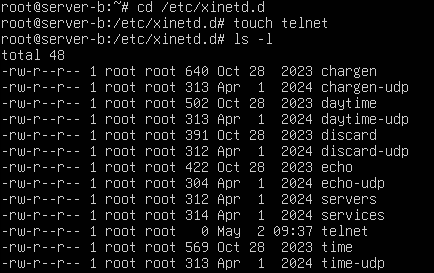
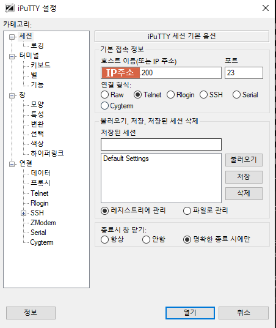
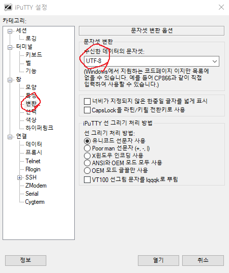
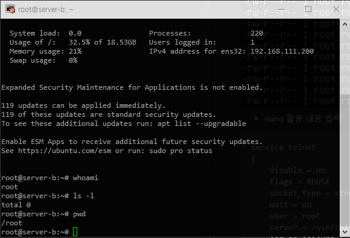
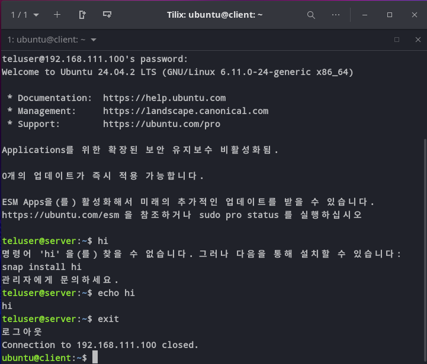

### VM Ware 활용 리눅스 TelNet 서버 구축

#### 관련 패키지 다운로드 (xinetd telnetd)
```bash
apt update
apt -y install xinetd telnetd
```

#### 설정

```bash
cd /etc/xinetd.d
touch telnet
```
- telnet 파일 생성



- nano 활용 내용 입력
```nano
service telnet
{
    disable = no
    flags = REUSE
    socket_type = stream
    wait = no
    user = root
    server = /usr/sbin/telnetd
    log_on_failure += USERID
}
```

- 사용자 생성 및 세팅
```bash
adduser teluser
systemctl daemon-reload
systemctl restart xinetd
systemctl enable xinetd # 재부팅 해도 서비스 가동 설정
systemctl status xinetd # 가동여부 확인
ufw allow 23/tcp        # 23번 포트 허용
```


#### 다른 OS환경에서 접속하기

- PowerShell 로 접속하게 되면 한글 깨짐 현상이 일어난다.
- 해결을 위해 iPuTTY를 활용하여 접속했다.
    - https://github.com/iPuTTY/iPuTTY/releases    






- 접속이 잘 되는 모습, but 그냥 telnet 서버는 원격으로 접속이 가능하다는 장점이 있지만, 데이터 암호화가 되지않아 데이터 전송 도중 중요한 정보를 탈취 당할 수 있다, **보안이 강화된 텔넷서버나 SSH를 활용해야한다**.


## SSH 서버 구현

### 설치
```bash
apt -y install openssh-server

# 상시가동 / 재가동 / 가동여부 확인
systemctl enable ssh
systemctl restart ssh
systemctl status ssh

# 포트 열기
ufw allow 22/tcp
```

### 외부에서 접속
```bash
ssh 사용자명@IP주소

# 예시
ssh teluser@192.XXX.XXX.XXX
```



### X윈도우를 위한 XRDP 서버
- apt install xrdp
- systemctl start xrdp
- ufw allow 3389/tcp